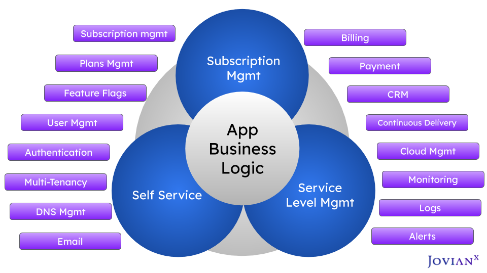

# Introduction to JovianX

## What is JovianX?

The **JovianX Platform** is a control plane for SaaS and cloud applications, allowing to build, and operate SaaS offerings, and fully managed cloud services.

JovianX is built for companies who are looking to start a **new SaaS business** or create a **cloud version of an existing software** product, without all the heavy investment it usually requires.

JovianX Platform provides a management console, with a rich set of services to build, run and manage a SaaS product. Including: application Management, Payments and Billing, Subscription Management, Multi-Tenancy, Application Life-cycle Management, Monitoring and Logging, Hosted self-serivce Signup, User Signup Designer, Authenticated application end-points and much much more.

JovianX is designed for _cloud architects,_ _SaaS business leaders,_ _DevOps_ and _Site Reliability Engineers \(SRE\)_. It allows cloud architects to design, build and manage a multi-tenant SaaS solution, it allows Site Reliability Engineers to manage service levels\([SLO](https://landing.google.com/sre/sre-book/chapters/service-level-objectives/)\) and operate the SaaS Solution, and lastly, it allows SaaS business leader to manage all the business aspects of a SaaS product, including defining and managing offering plans and provides dashboards for monitoring the SaaS business results \(MRR, ARR, LTV, Churn, CaC, etc'\).

## How does it work?

JovianX provides a hosted customer console that allows your customers to sign up for your cloud service. When a new account \(your SaaS customer\) signs up, JovianX creates all needed cloud resources for that account and creates a billing subscription for a chosen billing plan and selected options.

1. Your customer signs up.
2. JovianX creates the resources and deploys the application needed for the new account.
3. JovianX creates a billing plan, based on user-selected billing plan and options.

JovianX uses an [Application Blueprint](documentation/jovianx-application-blueprint.md) to create the needed cloud resources for a new account. The application Blueprint is a package \(a tar.gz file\) that contains an Application Manifest\(a file named `jovianx.yaml`\) and defining the rescues \(Kubernetes Helm package, or other cloud managed services such as AWS DynamoDB, Cloud SQL for example\) needed for new account creation.

