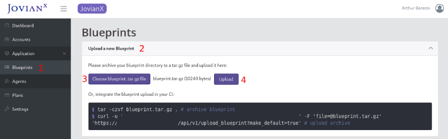

# Application

### Introduction

An application blueprint is a packaged tarball file \(`*.tar.gz`\) that contains the application manifest YAML file \(`jovianx.yaml`\) and Helm Charts. The application manifest defines the components used by the application. The components can be Helm Charts, or other cloud managed services. JovianX uses the Application Blueprint to create resources and set up services when a new account signs up. 

### Blueprint Structure

The application blueprint contains the following:

1. **Application Manifest** - The application manifest  is a YAML file named `jovianx.yaml`. The manifest defines all the resources needed for creation of a new SaaS account. For example Kubernetes Helm Charts, DynamoDB, CloudDNS or other cloud managed services.
2. **Helm Charts -** The blueprint can also include the Helm Charts that are used for creation of application services.

### Application Manifest\(`jovianx.yaml`\) 

The application manifest is a YAML file that describes the application. JovianX uses the manifest to create the needed resources and services when a new account signs-up.

A basic template  of an application manifest looks as following:


```yaml
# v1 - JovainX API Compatability
jovianx_api_version: v1

# string - Name of this SaaS application
application_name: '<APP-NAME>'

# semantic versioning - version of this JovianX blueprint 
version: <SEM-VERSION>

# string - Name of a component to be used a main application entry point 
main_endpoint_component: '<COMPONENT-NAME>'

# Components section defines all application components and their helm chart implementations
components:
  - name: '<COMPONENT-NAME>'
    version: <COMPONENT-SEMVER>
    provider: helm_chart
    helm_chart_name: <PATH/TO/HELM/CHART>
    helm_set:
      # List of key-value pairs to pass to helm on account creation
      - key: '<SET-KEY>'
        value: '<SET-VALUE>'
    endpoints:
      - name: '<ENTRYPOPINT-NAME>'
        type: entry_point
        service_name: '<KUBERNETS-SERVICE-NAME>'
        port: <KUBERNETES-SERVICE-PORT>
        path: '<KUBERNETES-SERVICE-PATH>'

# Settings Descripts define user inputs and 
settings_descriptors:
  # list of descriptos
  - name: <DESCRIPTOR-NAME>
    display: '<A QUESTION TO ASK THE USER ON SIGN-UP>'
    input_type: string
    default: '<DEFAULT ANSWER>'
    components:
      - name: '<COMPONENT-NAME>' # Provide value to this componet 
        helm_set:
          - key: '<SET-KEY>'
          
```


### Creating Application Blueprint

To create an application blueprint archive the application manifest and helm charts into a blueprint tar.gz

```text
$ tar -cf <BLUEPRINT-NAME> jovianx.yaml <HELM-CHART> ...
```


Note: Keep Helm Charts in open, untar format


Example: the following directory has an application manifest `jovianx.yaml` and a Chart `my-helm-chart`

```bash
├── my-helm-chart
│   ├── charts
│   ├── templates
│   ├── Chart.yaml
│   └── values.yaml
└── jovianx.yaml
```

To create an application blueprint for the directory use the following command:

```text
$ tar -cf blueprint-1.0.0.tar.gz jovianx.yaml my-helm-chart
```

### Upload Application Blueprint

#### Upload Blueprint via Web UI

To upload your application blueprint to JovianX via the web console:

1. Navigate to Blueprints page
2. Click on `Upload a new Blueprint` bar
3. Click on `Choose blueprint tar.gz` file
4. Click on `Upload` to upload your blueprint



Once the blueprint is upload you will be able to find it in the blueprints list, and view the application manifest.

#### Upload Blueprint via CURL\(CI\)

To upload your application blueprint to JovianX via an automated CI process or from command line, you will need to find your `API Access Key` and `API Secret`. You can find both in `Upload a new Blueprint` bar under `Blueprints` navigation bar.

```text
curl -u '<ACCOUNT-API-ACCESS-KEY>:<API-SECRET>' -F 'file=@<PATH/TO/BLUEPRINT/FILE.TAR.GZ>' 'https://<ACCOUNT-API-PATH>/api/v1/upload_blueprint?make_default=true'
```

