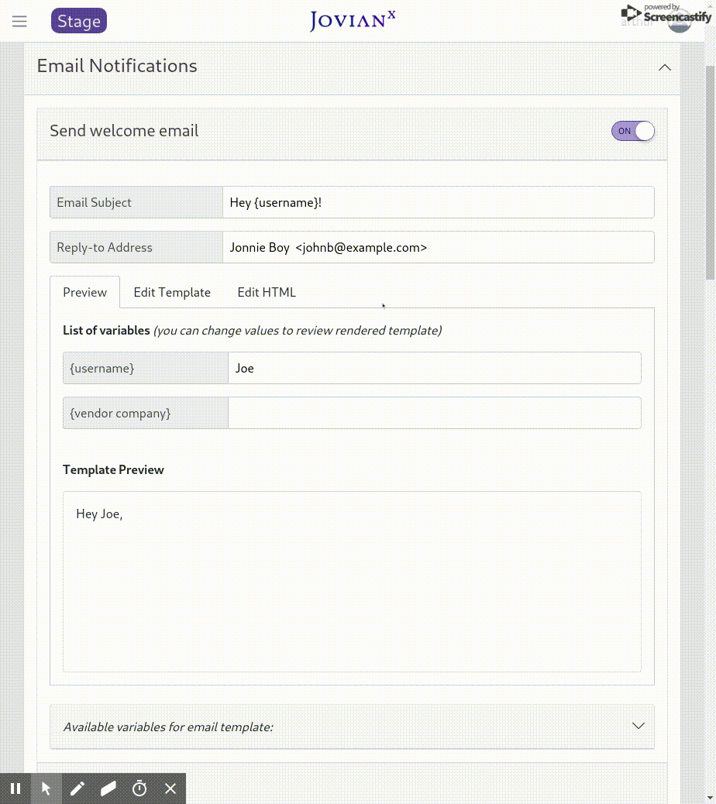
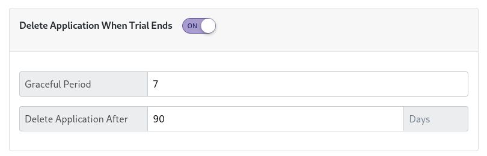

# Release Notes

### 1.15.1-20200816

Bug-fixes:

* Added console logs for kubeconfig dumping
* Octant embeded iframe is now 100%

## 1.15.0-20200802

New Features:

* 513-blueprint-output-in-dry-run
* 332-log-event-when-service-not-found
* 515-custom-menu-items

Bug Fixes:

* Fixed run-tests name generation [!501](/jovianx/jovianx-isv-portal/-/merge_requests/501) [\#159](/jovianx/jovianx-isv-portal/-/issues/159) \(closed\)
* Fixing auth URL to accept any subpaths
* 514-fix-on\_failure-property-of-hooks
* 510-broken-blueprint-does-not-set-error-app-state
* 517-skip-blueprint-error-on-customer-deletion
* 520-fix-simple-line-icons-css-build

## 1.14.0-20200727

**New Features:**

* Blueprint tests !496  \#159 
* Blueprint dry-run mode !499 \#159 
* Add Kubernetes Management\(Octant\) UI !498 \#508 \#483
* Support "Textarea" as setting\_descriptor !477 481 
* Helm\_set is optional, setting\_descriptor is optional !478 \#330 
* Prevent Blueprint removal for live accounts !486 \#161 
* Events now shown as YAML instead of JSON !493 \#428 
* AKS: Azure Kubernetes Service\(AKS\) management, it is now possible to connect to existing AKS clusters, initialize helm, and !472 \#473 
* AKS: It is now possible to create new AKS clusters from the JovianX UI. !484 \#492   
* Hooks support environment variables !488 \#498 
* Hooks support for service\_account\_name and namespaces !489 \#499
* Accept access\_token as an alternative to Auth Bearer token !487 \#497
* Auto-sync octant Kubeconfigs with JovianX loaded Kubeconfigs  \#486
* Support Kubernetes 1.16+ - Move to Kubernetes stable API Apps/V1 instead of AppsV1beta2Api!480 \#487  !496 \#505 

**Bug Fixes:**

* Fixed account page when not settings\_descriptors defined \#512
* Fixed run-tests name generation !501 \#159 
* Fixed save target context/cluster on deploy-time, show app from saved context. !482 \#488
* Defined Kubernetes and Helm timeouts to 30 seconds !494 \#509
* Fixed access token via auth subpath !485 \#496


###  1.13.2-20200624 

Bug Fixes:

* Validate Kubeconfig file on upload [!459](https://gitlab.com/jovianx/jovianx-isv-portal/-/merge_requests/459)
* Account deletion stuck in Terminating [!460](https://gitlab.com/jovianx/jovianx-isv-portal/-/merge_requests/460)
* Create an event on account status change [!461](https://gitlab.com/jovianx/jovianx-isv-portal/-/merge_requests/461)
* check\_application\_launch\_status crashes on incorrect DNS configuration [!462](https://gitlab.com/jovianx/jovianx-isv-portal/-/merge_requests/462)
* Events should be able to handle events with binary data [!464](https://gitlab.com/jovianx/jovianx-isv-portal/-/merge_requests/464)
* Node utilization dashboard breaks when no metrics coming from Kubernetes API [!466](https://gitlab.com/jovianx/jovianx-isv-portal/-/merge_requests/466)
* Change Blacklist wording to Blocklist [!475](https://gitlab.com/jovianx/jovianx-isv-portal/-/merge_requests/475)

New Features

* Set endpoints by settings\_descriptors [!471](https://gitlab.com/jovianx/jovianx-isv-portal/-/merge_requests/471)

### 1.13.1-20200512

Blueprint: It now possible to set application `endpoints` via blueprint `settings_descriptors`

```yaml
settings_descriptors:
  - name: ha
    display: 'Enable High availability cluster'
    description: 'This option will replicate your application across the world. It will drastically reduce latency'
    input_type: checkbox
    default: false
    select_options:
      - name: true
        components:
          - name: node-component
            helm_set:
              - key: ha0-manager
                value: true
            # added new directive `endpoins` under component setting_descriptors.
            endpoints:
            - name: 'application_web_interface'
              service_name: node
              type: main_entry_point
              entry_point_url: 'http://{{ account://end_company }}.jovianx.app/ha-true' 
              label: 'application_web_interface'
              port: 80
              dns: '{{ account://end_company }}.jovianx.app'

```

## 1.13.0-20200510

New Features:

* Account status: Accounts can now easily change the account status from Trial, Active and Suspended. [!441](/jovianx/jovianx-isv-portal/-/merge_requests/441)
* Application scale-down: JovianX now allows manually scale-down and scale-up an account application. Application Scale-down updates the controller replicas to 0, and Scale-up returns the replica count to the state it was before scaling down. [!442](/jovianx/jovianx-isv-portal/-/merge_requests/442)
* Application controller status: Show Kubernetes application StatefullSets, Deployment, Jobs, and Replicasets. [!431](/jovianx/jovianx-isv-portal/-/merge_requests/431)
* Event Automation: Variables are now supported in the webhook URLs. [!444](/jovianx/jovianx-isv-portal/-/merge_requests/444)
* User Invite Blacklists: User invitations now respect the email blacklist. [!454](/jovianx/jovianx-isv-portal/-/merge_requests/454)
* Kubernetes Kubeconfig is now optional. [!445](/jovianx/jovianx-isv-portal/-/merge_requests/445)

Bug fixes:

* Better handling of Helm communication errors with Tiller. [!446](/jovianx/jovianx-isv-portal/-/merge_requests/446)
* Fixed accounts list sorting. [!451](/jovianx/jovianx-isv-portal/-/merge_requests/451)
* Fixed Plans page, settings prices for feature flags. [!448](/jovianx/jovianx-isv-portal/-/merge_requests/448)
* Fixed application readiness check. [!452](/jovianx/jovianx-isv-portal/-/merge_requests/452)
* Fixed trials date display. [!453](/jovianx/jovianx-isv-portal/-/merge_requests/453)
* Fixed Job completing check status. [!455](/jovianx/jovianx-isv-portal/-/merge_requests/455)
* Updated icons and UI titles. [!456](/jovianx/jovianx-isv-portal/-/merge_requests/456)

### 1.12.2-20200412

#### Bug Fixes:

* Resolve "Change application manifest\(jovianx.yaml\) to root from ./ in blueprint". !440 \#423

### 1.12.1-20200411

#### Bug Fixes:

* Fixed: Added support for commas in helm parameter values. !439 \#420
* Fixed: Added an event that includes the generated helm release name to the account events. \#387
* Fixed: Added an event with an error message when starting an application with a non-existing context. \#412
* fixed: post\_install is now part of the application "starting" phase. \#405
* Fixed: DNS wildcards are now not deleted on account deletion. \#339
* Refactoring of vendor and customer-company internal business logic. !438 \#416

## 1.12.0-20200408

#### New Features:

* Resolve "Upload multiple Kubeconfig files" !351
* Resolve "Blueprint Linter" and add force\_update !423
* Resolve "Trigger Webhooks based on system events" !425
* Improve plans view !426
* Improved UX for the accounts list !427
* Resolve "Vendor Console: Delete account confirmation show account name" !429
* Resolve "Blueprint: choose component context" !437

#### Bug Fixes:

* Fixed Error message on kubeconfig file load !436 \#418 \(closed\)
* Resolve "Accounts not switching to Running" Added reties for helm errors in App status check !424
* Fix styles for Accounts page !428
* Change title crash to error !433
* Resolve "change kube\_context\_conf to kube\_context" !434
* Fix header field !435
* Error message on kubeconfig file load !436

### 1.11.5-20200308

#### BugFixes:

Fixes Update application fails if there's no admin\_email and admin\_password in the blueprint !422 \#402

### 1.11.4-20200305

#### BugFixes:

Updated Flask and Gunicorn to last versions !421 \#401

### 1.11.3-20200227

#### Bug Fixes:

Fixed update application with dot\('.'\) in the blueprint are not started successfully !419 \#392 

Fixed agent pull mechanism from external sources !420 \#393

### 1.11.2-20200224

#### Bug Fixes:

Fixed automated email notification "X days after signup" reminder not sent !414 \#386

Fixed application status not changing to 'running' when helm does not have a supported controller object\(ie when the helm chart doesn't have any of the following objects: Deployment, StatefulSet, ReplicaSet, Service\). !415 \#389 

Update accounts page to show 30 accounts in ascending order by creation time. !413 \#385

### 1.11.1-20200213

#### Bug Fixes:

Fixed email notification `BEFORE_TRIAL_ENDS` - !408 \#382

Log application status changes in the events. - !409 \#372

Abandoned accounts \(ie accounts that did not complete configurations and app was not started\) redirect to complete account configuration page. - !406 \#380

Fixed DNS records are not deleted when deleting account - !410 \#384

Fixed bug in application Upgrade - !407 \#381

## 1.11.0-20200210

**New Features**:

**Blueprint: Shared Components** are now naively supported. This allows creating and managing components that can be shared and accessed by all account components. To add a shared component, in the application manifest \(jovianx.yaml\) set the directive `deploy_per: application` in the component you would like to be shared. Example shared component:

```yaml
  - name: mongodb-component
    version: 1.0.0
    provider: helm_chart 
    helm_chart_name: mongodb-chart
    deploy_per: application # <--------Shared componnet directive
    helm_set:
      - key: mongodbUsername
        value: user
      - key: mongodbDatabase
        value: test_db
```

This allows managing the life-cycle of the component separately from individual account components. To manage the life-cycle of shared components, and review shared component status, go to Application &gt; Share Components, this allows to start , stop and upgrade shared components.  \(!336 \#274\)


**Email Notifications Cc and Bcc**: Now you can add Cc and Bcc to all email notifications sent to accounts  \(!393 \#368\)


**Blueprint Download:** You can now download a blueprint archive from vendor Console !392 \#204


Email notifications: Report email on errors. It is now possible to receive email notifications when errors occur on account creation. To configure email notifications go to Email Notifications &gt; Send email after application started, on the bottom of the card setup `Report errors to`    \( !387 \#367\)


**Email Notification Events:** An  event is created on sending email notifications !402 \#378

**Helm retry Mechanism:** When there helm communication errors occur there's a new retry mechanism that re-tries to execute the command when a re-execution can succeed. !399 \#377

#### Bug Fixes:

Fixed save PayPal secret details - !389 \#361

Fixed endpoints URL on Customer Console  !398 \#375

Added Limitation of number of vendors !403 \#354

### 1.10.2-20200120

#### Bug Fixes:

Resolve UX small labels \(!384 \#363\)

### 1.10.1-200115

#### Bug Fixes:

Fix Agree to terms of use and Privacy Policy if configured \(!382 \#360 \)

Fix "Customer Console progress bar design \(!381 \#359\)

Fix app dashboard disappears when clicking on "App" top navigation tab"\(!380 \#358\)

## 1.10.0-200112

#### New Features:

**Added pagination** for Blueprints, Accounts, Upgrade button \(!374 \#335 \)

**Remove pricing when price is 0**, add billing cycle indication\(!375 \#347\)

**UI and UX improvements in customer console hosted sign-up** \(!377 \#352\)\(!378 \#355\)\( !379 \#356\)

#### Bug Fixes:

Remove unused email var `application url`and fix broken source editor in Email Editor \(!369 \#327 \#329\)

Fix get Favicon/Custom CSS/CustomJS \( !376 \#351\)

### 1.9.1-191224

#### Bug Fixes:

Fixed endpoints API which returns an error when one/more components don't have endpoints \(!373 \#342\)

## 1.9.0-191224

#### New Features:

**Blueprint: Disable endpoints for disabled components:** When a component is disabled, either as a part of component configuration by a \`setting\_descriptor\`, all component's endpoints are disabled too. \(!372 \#337\)

```yaml
...
components:
  - name: component-name
    enabled: false
    endpoints:
      - name: 'User application'
        service_name: kubernetese-service-name.namespace
...
```

**UX: New Plan form Plans Page**: Create new plan page is now available as a separate page, accessible form the plans list page   \(!365 \#318\)


**Customer Console Card:** It is now possible to create your own application cards to the customer console. A new endpoint type: card is now available, which shows the content of the entry point URL as a card on the customer console \(!337 \#278\)

```yaml
endpoints:
  - name: 'Application API'
    service_name: node
    port: 8008
    path: /api
    type: card  # <---------------
    dns: '*.jovianx.app'
    entry_point_url: 'http://{{ account://end_company }}.example.com/app'
```


**Email Notifications: endpoint links and labels templates** - You can now reference all your endpoint labels and URLs in the email notification template  \(!347 \#288\)   


```yaml
endpoints:
  - name: my_cool_app
    service_name: "{{ account://components/my_component/helm_release_name }}-my-k8s-serivce"
    label: "My cool app" # <--------
    port: 9090
    path: /
    type: main_entry_point
    dns: '{{ account://end_company }}.cloud.example.com'
    entry_point_url: 'https://{{ account://end_company }}.cloud.gigaspaces.com:'
```

**UX:  Embeddable account creation form iFrame does not show footer** links to terms and conditions and and privacy policy \(!370 \#328\) 

**UX:** New icons on the global dashboard \(!368 \#326\)

**UX:** New icons on account application dashboard \(!371 \#338\)

#### Bug Fixes:

Fixed: Account status icons are not shown \(!363 \#319\) 

Fixed: Side navigation nested routes are misaligned !364 \#322\) 

Fixed: app actions buttons alignment !366 \#323\) 

Fixed: Customer Console redirect to application internal authentication is not redirecting into app \(!367 \#325\)

## 1.8.0-191211

**NEW FEATURES**:  
**Blueprint: Immutable settings** - It is now possible to create user defined settings\(via `settings_descriptors`\) that are immutable. This prevents the end user from being able to change settings that were selected on account creation.  \(!360 \#283\)

Example: 

```yaml
settings_descriptors:
  - name: some_feature
    display: 'Enable this cool feature'
    description: 'This option will enable this cool feature'
    input_type: checkbox # immutable applies to any input type
    immutable: true   # <----------
    
```

  
**Blueprint: endpoint labels** - Allows defining labels to endpoints, the labels are presented in the customer console instead of endpoint URL \(!342 \#287\)

```yaml
- name: 'Application API'
  service_name: node
  port: 8008
  path: /api
  type: entry_point
  entry_point_url: 'http://{{ account://end_company }}.jovianx.app/app'
  label: 'This Is My Cool App Endpoint' # <------------------------------------
```

  
**Email Notification: Added {trial days left} and {trial days total} to all templates** - When creating email templates it is now possible to show the trial time and how many days left in the trial \(!346 \#280\)


**Change trial end date for trial accounts** - You can now change the trial end date for existing trial accounts \(!352 \#292\)


\*\*\*\*

  
 **Account application status dashboard shows Kubernetes objects status** \(!359 \#308\)


**UX: Email preview variables are unified with variables preview** \(!354 \#314\)


**UX: Show confirmation for save action** \(!344 \#293\)



  
 **UX: Settings in side menu are split into separate pages** \(!348 \#296 \#297\)


**UX: Plans in side menu are split into separate pages for plans list and  create a new plan page** \(!361 \#313\)


 **UI: Login page support for smaller screens** \(!356 \#311\)


UX: Align title styles and sizes \(!355 \#312\)  


**BUGFIXES**:  
 Sporadic delays in async and scheduled tasks execution\(!349 \#303\)

Agent bootstrap-config link is not created correctly\(!353 \#305\) 

Font sizes remain same on UI ReactsJS build\(!362 \#317 \#320\)

Email notification doesn't use correctly environment variable "{ username }" \(!350 \#304\)

Application Entry points table is now shown correctly\(!357 \#309\) 

Remove redundant button "Open Customer Console" from account page \(!358 \#310\)

## 1.7.0-191119

#### New Features:

**Blueprint: ability to enable and disable components by settings descriptors** _-_  This allows adding and removing helm charts based on used selected settings. For example deploy additional software components when the user selects to enable additional features. \(!326 \#264\)

```yaml
...
components:
  - name: kafka
    version: 1.0.0
    provider: helm_chart
    helm_chart_name: kafka
    enabled: false # <-- Kafka is *not* installed by default 
...
settings_descriptors:
  - name: select_use_case
    input_type: select
    default: 

    select_options:
      - name: install_kafka
        display: "Enable Kafka by this selection"
        components:
          - name: kafka
            enabled: true # <-- enable Kafka if users selects option
...
```

**Blueprint: Checkbox with single option action** - This allows defining checkbox in setting descriptors with actions only when enabled, or only when disabled    \(!330 \#217\)

```yaml
...
settings_descriptors:
    - name: VPNTunnel
    display: 'Enable VPN tunnel'
    description: 'Setup cennection to your app via VPN tunnel'
    input_type: checkbox
    default: true
    select_options:
      - name: true # <-- helm_set used only when true, no action when false
        components:
          - name: node-component
            helm_set:
              - key: enable_vpn
                value: true
...
```

**Blueprint: Design entry\_point\_url when DNS uses wildcards** -  When using wildcards in DNS names and Kubernetes Ingress, it is now possible to define the entrypoint URL template for the endpoint. \(!331 \#276\)

```yaml
endpoints:
  - name: 'User application'
    service_name: ingress.ingress-namespace
    port: 80
    path: /app
    type: entry_point
    dns: '*.example.com' # <-- DNS Wildcard 
    entry_point_url: 'https://{{ account://end_company }}.example.com/app' # <-- Optional, If found, use this URL


```

 **Blueprint: Disabled radio and Disabled Select** - It is now possible to defined disabled select and radio options in setting descriptors, this is useful for showing features that are not yet available or presenting featured that were deprecated. \(!338 \#289\)

```yaml
  - name: cloudProvider
    display: 'Cloud Provider'
    description: 'You can select amoung three leaders of cloud infrastructure'
    input_type: radio
    default: azure
    description_title: 'Choose your provider'
    select_options:
      - name: do
        enabled: false # <-- Disabled radio option
        display: 'Digital Ocean'
        
  - name: support
    display: 'Support package'
    input_type: select
    default: premium
    description: 'Basic support is included for all customers and covers availability of the Atlas service, connectivity issues, and questions about the UI or platform features.'
    select_options:
      - name: '24/7'
        display: 'support 24/7'
        enabled: false # <-- Disabled select option
```


**Email notification template HTML editor** - It is now possible to edit the HTML of email notification templates. \(!340 \#272\)



**"Terminate application" option on all app states** - Previously the Terminate Application option was available only when the application was in "running" state, now it is possible to terminate the application on all intermediate states. \(!333 \#166\)


**Customer Console: Application Settings** - users can now view and update their settings from the customer console\(!335 \#275\)


**Customer Console: Show Agents only when an agent was uploaded** \(!329 \#277 \#279\)

**Customer Console: Custom HTML page for while app in starting state** - It is now possible to show a custom HTML page while the application is starting and all components and getting ready to be used by the user. \(!334 \#253\)


**Back button from pod/service/storage views.** \(!341 \#285\)


#### Bug Fixes:

**Helm connection stream errors** were causes issues fetch app statues, now helm connection errors have special handlers. \(!339 \#286\)

**Validate email template variables before saving** - All email notification templates and used account variables { } are now validated upon saving. \(!328 \#230\)

**Pods In pending are now show their pending messages** \(!327 \#266 \)

**Prevent negative numbers in the wizard**\(!332 \#149\)

**Login screen: enter key triggers login**\(!343 \#291\)


## 1.6.0-191029

#### New Features:

**Set email notification FROM field, Set Subject per notification type** - It is now possible to define the reply-to address and the subject line for each of the notification emails sent to end customers. \(!215 \#260\)


**Delete inactive accounts with grace period and auto delete** - Now it is possible to configure auto-delete period for accounts that are not active\(non-paying and out of trial\), it is also possible to set the grace period which scales down the application for predefined period before deleting use data. \(!281 \#177 \#178 \#179 \#132 \#254\)



**Optional Payment on signup** - It is now possible to make payment optional on signup and not require the end user to provide payment details on registration. \(!325 \#218 \#231\)


**Embedded Signup iframe snippets** - You can now just copy/paste our code snippets to embed JovianX signup page within your marketing landing pages. \(!317 \#267\)


#### 

**Vendor-to-EU Invitation email template editor** - You can now edit the email template that is sent when a user send an invite to a team member. \(!307 \#243\)


**Application start failures are now logged as events.** \(!318 \#269\)

**Updated UI and UX elements for signup and registration wizard.** \(!320 \#227\)

**Blueprint: input\_type: select and input\_type: radio now use the  the first option as default.** If the default option is not defined or empty the first option is now selected as default. ****\(!323 \#270\)

#### Bug Fixes:

Invite members now sends signup URL with HTTPS instead of HTTP\(!313 \#265\)

External IPs are now displayed correctly \(!324 \#248\)


## 1.5.0-191020

#### New Features:

\#262 **Embeddable Account Signup** - It is now possible to embed JovianX account signup in your own marketing landing pages.


\#252 **Select Blueprint Version on account creation** - It is now possible to select the blueprint version  for creating a new account on SaaS admin console.

#### Bug Fixes:

\#265 BUGFIX: invite members now sends invitation links with correct scheme\(http/https\)

\#219 BUGFIX: Favicon in customer Console now refreshes on new ICON upload.

\#259 BUGFIX: Application entrypoints UI now supports showing services from other namespaces\(Ingress use-case\)

\#250 BUGFIX: Main dashboard now shows volume sizes correctly 

\#258 BUGFIX: Account Application page now doesn't show Oops message when app started with blueprint that doesn't have plan.

## 1.4.0-191014

**New Features:**

\#210 **Account user management**: Allow JovianX SaaS administrators to invite co-workers into the account.   
Support management of account's users including invitation and removal from an account. 


\#257 **Blacklist email domains:** It is now possible to configure a list of email domain names that are not permitted to sigh-up. This can be used for blocking non-work related email address.


\#256 **Application Manifest: Support `service_name` with namespaces as part of `endpoint`configuration.** This can be used for creating DNS A records with an Ingress controller IP address on new account creation.   
Following example is now supported:


```yaml
...
    endpoints:
      - name: 'User application'
        service_name: node.this-is-a-namespace
        dns: '{{ account://end_company }}.jovianx.app'
        ...
```


\#255 **Application Manifest: First occurrence of `entry_point` acts as default** `main_entry_point` in case  `main_entry_point` is not specified.

\#209 **Optionally Prevent users from self-signup into existing account.** 

\#238 **Helm execution outputs are not logged as account events.** This helps to better understand Helm related executions. 

Bug Fixes:

\#249 BUGFIX: Oops error message is shown in some cases when a pod in pending state. 

\#240 BUGFIX: On account creation screen align custom text field with default text fields. 

\#246 BUGFIX: Align settings toggles to the right.

## 1.3.0-191001

**New Features:**

\#226 **Application URL Template in Email notifications** - Added new template `{Application URL}`  that allows using the URL for the application in the email notification that is sent after the application starts.

\#228 **Account Signup Custom Fields Order** - It is now possible to change the order of the fields on sign up form.  


\#229 **Log End User Login Events** - When an end-user is logging into the application an event is created in events log.


\#221 **DNS TTL 1 Sec** - DNS records are now created with TTL of 1 second for faster availability.

\#214 **Wait Message While App Starts** - For some applications take longer time to start after a user signs up. It is now possible to setup a custom waiting message that is shown on signup.   


\#224 **Kubernetes Resources Tabs**: All Kubernetes resources can be found in tabs view for improved visibility of all Kubernetes resources related to an account.


\#222 Show correct protocol http and https for ports 80 and 443

\#223 Kubernetes services now show all available ports exposed by service with links

**Bugfixes:** 

\#212 BUGFIX: Accounts didn't show correctly when some metadata was missing due to missing  configuration 

\#233 BUGFIX: Agent install instructions on account view was not shown

\#235 BUGFIX: Manifest: `helm_set` is now optional in application manifest.

\#232 BUGFIX: Account creation button was disabled when `agree to terms of use` was not required

\#225 BUGFIX: Agree on terms switch is now off by default, making terms of use an opt-in requirement


## 1.2.0-190911

\#191 - Helm release name is now a random 5 chars string to support long account and vendor names

\#199 - Blueprint can access the auto generated helm release name via `{{ account://components/<COMPONENT-NAME>/helm_release_name }}`

\#194 - Admin console \| Display application settings and helm parameters in tables

\#195 - Support application DNS names in customer console and admin console.

\#183 - UX \| Enhance data Loader mechanism

\#200 - UX \| Improved page loader

\#198 - BUGFIX - Pricing is calculated incorrectly, PayPal configuration can prevent the application from starting correctly.


## 1.1.0-190908

#### Vendor Console 

\#175 - End User Reset Password

\#103 - Application Manifest Settings Descriptions

#### End User Wizard

\#192 - End User Signup Wizard Enhancement for drop down menu

\#189 - End User Signup Wizard Enhancement - UI

\#164 - Admin Console Reset Password

\#182 - Button spinners on long operations 

\#186 - End User Signup Wizard static width

\#151 - End User Signup Wizard recalculates price on on-action

#### BUGFIXES

\#185 BUGFIX - DNS is invoked even when disabled causing applications not on start

\#168 BUGFIX - Accounts are not deleted correctly when PayPal is disabled

\#190 BUGFIX - Account trial period is not calculated correctly

\#100 BUGFIX - Vendor Console account creation now tests password length 


