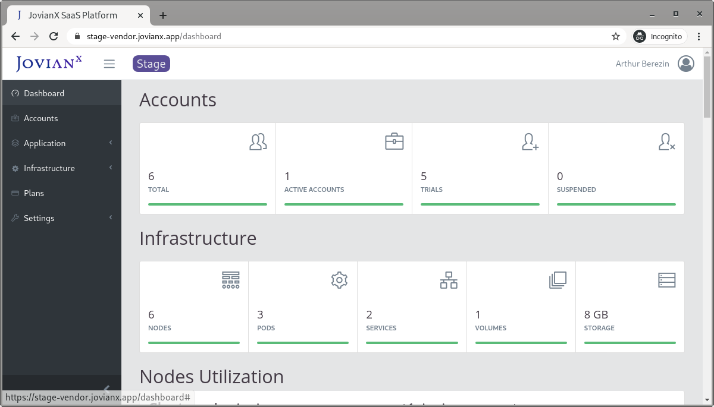

# Dashboard

The main dashboard provides **accounts** overview information for all the managed accounts, and overview of the consumed cloud **infrastructure** resources. 

## Accounts

The accounts section includes account metrics metrics.

**TOTAL** - The total number of accounts managed by JovianX.

**ACTIVE** - Accounts with Active subscription.

**TRIAL** - accounts that are in Trail period. 

**SUSPENDED** - Suspended accounts are accounts that did not activate the account after trial period, or account did not renew payment subscription, or accounts that were suspended manually.

## Infrastructure

The infrastructure section shows metrics of managed cloud resources.

**NODES** - Total number of Kubernetes nodes across all connected clusters. 

**PODS** - Total number of managed [Pods](https://kubernetes.io/docs/concepts/workloads/pods/pod/) across all Namespaces/Clusters.

**SERVICES** -  Total number of [Kubernetes services](https://kubernetes.io/docs/concepts/services-networking/service/) across all Namespaces/Clusters.

**VOLUMES** - Total number of [Kubernetes volumes](https://kubernetes.io/docs/concepts/storage/volumes/) across all Namespaces/Clusters.

**STORAGE** - Total amount of storage used by all managed accounts.

