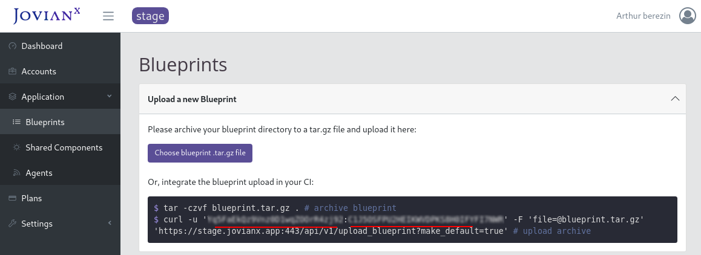

# Getting Started with JovianX

#### Table of Content

1. [Create and upload application blueprint](getting-started-on-jovianx.md#step-1-create-and-upload-application-blueprint)
2. [Setup subscription plan](getting-started-on-jovianx.md#step-2-setup-a-subscription-plan)
3. [Configure basic settings](getting-started-on-jovianx.md#step-3-basic-settings)
4. C[reate customer account](getting-started-on-jovianx.md#step-4-creating-customer-accounts)

### 1. Create and upload the application blueprint

To get started creating your managed SaaS with JovianX, create your first [application blueprint](). You can start by cloning the Hello SaaS World example blueprint from [GitHub](https://github.com/jovian-x/hello-world-saas-app).

```bash
git clone git@github.com:jovian-x/hello-world-saas-app.git
```

#### Step 1 - Review application manifest:

Review the application manifest file \(a YAML file named [`jovianx.yaml`](https://github.com/jovian-x/hello-world-saas-app/blob/master/jovianx.yaml)\). The application manifest has 2 main sections: the first is `Components` which declares service components with their properties, and the second is `settings_descriptors` which allows end-users to choose settings and control properties on signup.

To review the application manifest file use cat command:

```bash
cat hello-world-saas-app/jovianx.yaml
```


```yaml
# JovianX API Compatibility
# v1
jovianx_api_version: v1

# Name of this SaaS application
# string
application_name: hello-world-app

# version of this JovianX blueprint
# semantic versioning
version: 1.0.0
...
```


#### Step 2 - Create application blueprint archive

An application blueprint is a `*.tar.gz` archive that contains an application manifest file\(`jovianx.yaml`\) in it's root directory, and also includes all the helm chart directories referenced in the application manifest `Jovianx.yaml` file.

Review the files in the blueprint:

```bash
tree hello-world-saas-app/

hello-world-saas-app/
├── jovianx.yaml
├── LICENSE
├── mongodb-chart
│   ├── Chart.yaml
│   ├── values.yaml
│   └── ...
├── node-chart
│   ├── Chart.yaml
│   ├── values.yaml
│   └── ...
├── README.md
...
7 directories, 39 files
```

Create a `tar.gz` archive with the application manifest file\(jovianx.yaml\).

```bash
cd hello-world-saas-app/
tar -czvf blueprint.tar.gz jovianx.yaml node-chart/ mongodb-chart/ values/
```


**NOTE:** Make sure the the application manifest file \(file named`jovinax.yaml` is in the root of the archive file, and also that the archive includes all referenced helm charts as non-archived directories.



You can name the blueprint archive any name you like, the best practice is to include the application name and version in the filename, i.e \`myapp\_blueprint\_4.13.0.tar.gz\`.


#### Step 3 - Push the application blueprint to JovianX

Push the application blueprint to JovianX via the UI, or via API. 



To push the blueprint via the API using Curl command:

```bash
curl -u '<ACCOUNT_API_KEY>:<ACCOUNT_API_SECRET>' -F 'file=@blueprint.tar.gz' 'https://<YOUR ACCOUNT NAME>.jovianx.app/api/v1/upload_blueprint'
```


**NOTE**: You can find your `ACCOUNT_API_KEY` and `ACCOUNT_API_SECRET` in the blueprints page under Upload a new Blueprint card. You can also integrate the push operation with your CI workflow.



**NOTE**: You can also set the blueprint as ACTIVE by adding the querystring `?make_default=true` to the API path.




To push the application blueprint via the Web UI:

1. Navigate on the side-menu to `Application > Blueprints`.  
2. Click on the top card titled `Upload a new Blueprint`.
3. Click on button `Choose blueprint tar.gz file` 





### 2. Setup a subscription plan 

A plan determines the recurring period of a subscription and can determine how much to charge for each billing period, it can also enable or disable the trial, and determine the trial period. 

#### **Create a plan:**

1. Using the side-meue navigate to `Plans`
2. Click on `Create new Plan`
3. Choose plan settings and enable Trial
4. On the bottom of the screen click on `Create new plan Version`
5. Review the newly created plan in plans list 



**NOTE**: You must have at least one plan in your account.



**NOTE**: To enable "Require payment details on subscription", first enable payments and configure your PayPal account by navigating to `Settings > Payments > Enable PayPal.`


### 3.Basic settings

In the settings section you can configure many aspects of your managed service, including integration with a private Docker registry, Cloud DNS, cofngire your Kubernentes KUBECONFIG files, define the behavior of the customer console 


### 4. Create a customer account

Navigate to the customer console and create an example test account


### 


