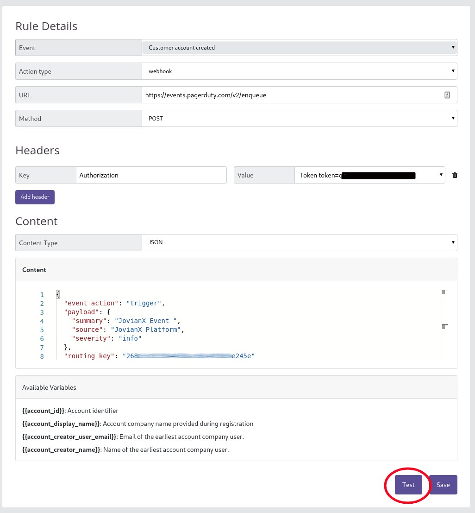
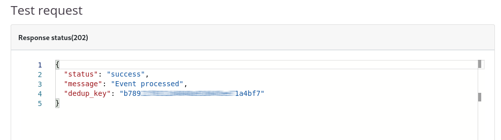

# PagerDuty + JovianX Integration

JovianX supports integration with PagerDuty, to automatically create and triggers production incidents within PagerDuty, and automatically mark resolved incidents when they are resolved.

## Benefits

* Notify on-call respondents when the application status of an account turns to `Error` state. 
* Automatically mark issues as Resolved when application's status switches from Error to Running. 
* One-way event notification forwards from JovianX to PagerDuty.

## How it works

JovianX Automation feature allows triggering external cloud services on events happening within JovianX, and data from JovianX to the service. This integration uses the `Application Error` event, which triggers the PagerDuty Events V2 API, to create an incident within PagerDuty. 

## Requirements

* PagerDuty integrations require an Admin base role for account authorization. If you do not have this role, contact an Admin or Account Owner within your organization to configure the integration.
* PagerDuty &lt;&gt; JovianX integration requires an **`integration key`**, and alerts and incidents must be enabled. Integration keys are generated by creating a [new service](https://dev-jovianx.pagerduty.com/services/new) or by creating a new integration for an existing service.

## Support 

If you need help with this integration, contact support@Jovianx.com or open a ticket with the customer support portal. 

## Integration Walkthought  

Follow steps below to setup the integration between JovianX and PagerDuty.

## In PagerDuty 

#### Integrating With a PagerDuty Service

1. On the top menu, click on  **Configuration** &gt; **Services**.
2. Add an I**ntegration** to a service through **ONE** of the following methods:
   1. Add integration to **existing service** - Click the name of the service where you want to add the integration. Then select the Integrations tab and click **New Integration,** and copy the **Integration Key**. The Integration Key will be used to connect JovianX Platform to the PagerDuty account. 
   2. **Create new Service** -  Click on "+ New Service" button, set the name of the new service to "JovianX Platfrom", then select **Integration Type**: **Use our API directly** with **Events API v2,** configure the rest of the Pagerduty settings, and click on "**Add Service**" button at the bottom of the screen. On the next screen navigate to the **Integrations** tab, and copy the **Integration Key**. The Integration Key will be used to connect JovianX Platform to the PagerDuty account.




## In JovianX Platform

#### Create New JovianX Event Automation Rule 

Create a new Rule 

1. On the left menu click on `Automation` and then click on `Create Rule`


2. Create a new rule with the following configuration:

* [ ] Choose the event type: `Application Error`
* [ ] Application Type: `Webhook`
* [ ] URL: `https://events.pagerduty.com/v2/enqueue`
* [ ] Content Type: `JSON` with the following content:

```javascript
{
  "event_action": "trigger",
  "payload": {
    "summary": "Account {{account_display_name}} changed to ERROR state.",
    "source": "JovianX Platform",
    "severity": "error"
  },
  "routing_key": "<PAGERDUTY INTEGARTION KEY>"
}
```

3. To test the configuration click on **Test**



A successful call to PagerDuty should result in a similar response. On the PagerDuty console a new incident should be created.  




4. Click on **Save** if the test result was successful. 


Note: You can read further about PagerDuty API on the PagerDuty API documentation. 

[https://developer.pagerduty.com/docs/events-api-v2/trigger-events/](https://developer.pagerduty.com/docs/events-api-v2/trigger-events/)



