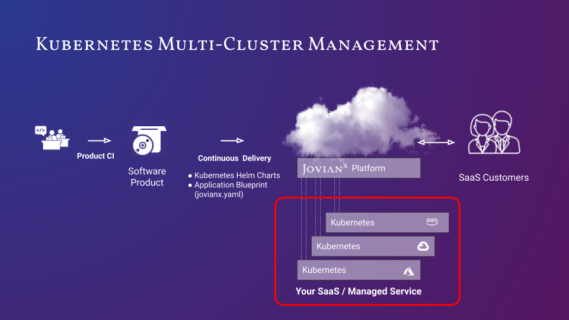

# Adding Clusters to JovianX

JovianX supports management of multiple  Kubernentes clusters, allowing to run and manage workloads on multiple cloud providers in multiple regions simultaneously. 



## Kubeconfig Kubernetes Cluster Access File

Kubernetes uses a YAML file called [`kubeconfig`](https://kubernetes.io/docs/tasks/access-application-cluster/configure-access-multiple-clusters/) to store cluster authentication information. JovianX uses `kubeconfig` files to access the Kubernetes clusters.  The `kubeconfig` file contains a list of contexts to which JovianX can refer when running Kubernetes operations. 

### Step 1 - Prepare an administrative Kubeconfig file 

Create a new `kubeconfig` file, which will be used for controlling the Kubernetes cluster. 

The `kubecofnig` files should include configuration for `context`, which should define a `cluster`  and a`user` . User is a Kubernetes service account that has the **cluster-admin** role. 

#### Example Kubeconfig file


```yaml
apiVersion: v1
clusters:
- cluster:
    certificate-authority-data: <CA-CERT>
    server: https://<KUBERNETES-CLUSTER-IP>
  name: <CLUSTER-NAME>
contexts:
- context:
    cluster: <CLUSTER-NAME>
    user: <SERVICE-ACCOUNT>
  name: <CONTEXT-NAME>
kind: Config
preferences: {}
users:
- name: <SERVICE-ACCOUNT>
  user:
    token: <ACCESS-TOKEN>

```



Read more about Kubeconfig in the official[ Kubernetes documentation.](https://kubernetes.io/docs/tasks/access-application-cluster/configure-access-multiple-clusters/)



You can **generate an administrative Kubeconfig** file using the Generate-Kubeconfig script [https://github.com/JovianX/Generate-Kubeconfig](https://github.com/JovianX/Generate-Kubeconfig).

`$ ./kubeconfig-create.sh  
Generate administrative Kubeconfig file for your cluster`

`This script generates a Kubeconfig file that allows full administrative access to your cluster Please note that this creates a Kubernetes service account 'jovianx-admin' with` _`CLUSTER-ADMIN`_ `role in the 'jovianx-system' namespace.`

`Proceed?[Y/n]  
...`


### Step 2 - Upload Kubeconfig files 

JovianX uses Kubeconfig files to interact with a Kubernetes cluster. To upload a Kubeconfig file:

1.  navigate to `Settings` &gt; `General` &gt; `Application`
2. Open  `Kubernetes configuratio`
3. Click on **Select Kubeconfig file**

Once you upload a Kubeconfig file, all cluster details are visible in the main dashboard. 



**Note**: The Kubeconfig file should specify a service account with **cluster-admin** role, and should include an authentication **token,** as show in [example above.](kubernetes-multi-cluster-management.md#example-kubeconfig-file) 



JovianX allows uploading multiple Kubeconfig files, and supports one context per file. 


### 

### Step 3 - Add Kubernetes Context to the blueprint  

JovianX allows defining what context to use for each component, thus, to define where to deploy component's Helm Chart.

The definition can be set in the `components` section, making it a static definition. Or by setting the context by  `settings_descriptors`,  which allows the user to provide input\(option selection\) that results in setting context for a component. 

You can add context in the `component` directly, or set it by `settings_descriptors`.

#### **Set the context by `component`:**

To set the context in the components section, making it a static setting, add the `kube_context` directive:

```yaml
  - name: node-component
    version: 1.0.0
    provider: helm_chart 
    helm_chart_name: node-chart
    kube_context: <KUBERNETES-CONTEXT-NAME> # <---------------------
    ...

```

#### Set the context by  `settings_descriptors`:

To set context by a user input for a setting descriptor, add the `kube_context` directive in the `components` section:

```yaml
  - name: choose_cloud_region
    display: 'Choose cloud provider region'
    input_type: radio
    default: 'us-west-1'
    select_options:
      - name: 'us-west-1'
        display: 'US West (N. California)'
        components:
          - name: node-component
            kube_context: <us-west-1 KUBERNETES-CONTEXT-NAME> # <-----------
            ...
      - name: 'us-east-1'
        display: 'US East (N. Virginia)	'
        components:
          - name: node-component
            kube_context: <us-east-1 KUBERNETES-CONTEXT-NAME> # <-----------
            ...

```

`kube_context` is a supported directive for settings\_descriptors of the following descriptor types: radio, select and checkbox

