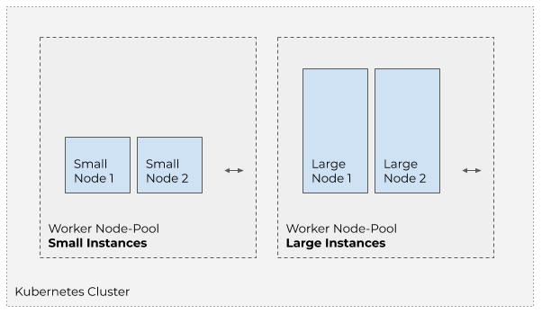
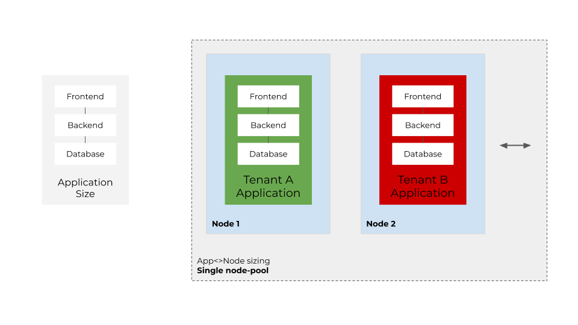
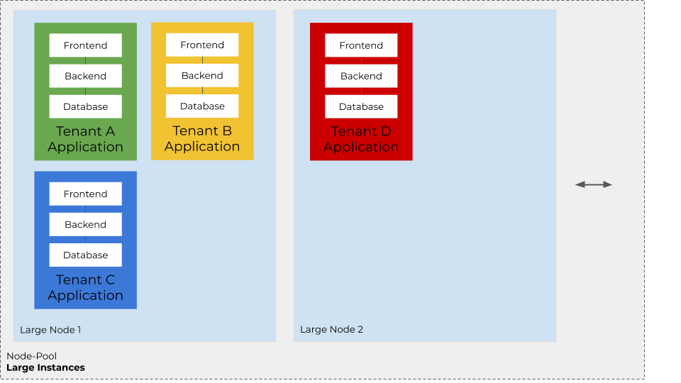
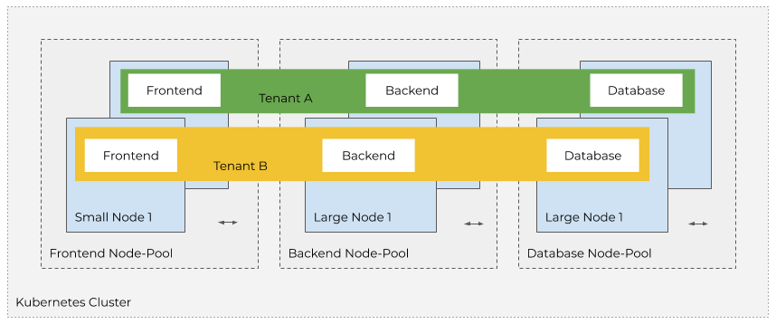

# New Cluster Considerations

JovianX supports adding your own Kubernetes clusters. When creating a new cluster to be used with JovianX Platform, there are few considerations that should be taken into account. 

### Cluster Naming

The cluster name should include the following:

1. Include "**jovianx**" and **your company name** as part of the cluster name.
2. Include the name of the **cloud provider** \(ie aws/gcp/azure\).
3. Include the **region/zone** name.
4. Include your own **cluster id**, this can be a string describing the specific purpose of the cluster\(ie staging, trials, sandbox\) or cluster count index\(useful when utilizing multiple clusters per region\).

A good example for cluster name would be `jovianx-acme-aws-us-east-2-prod`.

### Cloud Provider, Cluster Location and Type \(Zonal/Regional\)

Consider carefully the cloud provider, and the region/zone where the cluster is located. **End-users prefer to utilize services that are co-located with their other resources**. For example if your users run their infrastructure services on AWS US-East, they would prefer to co-locate your cloud service in the same region or zone and on the same cloud provider.

You can also make your service available in multiple cloud providers and regions, and allow the users to choose their cloud provider and region. 

In GKE, when creating a new cluster the cluster's master node runs in a **single zone**. You can define a new GKE cluster as **Regional cluster**. Defining a new cluster as regional cluster increases it's availability, so if one zone become unavailable, or the cluster undergoes upgrades, the cluster's control plane remains accessible.  

GCP doesn't charge an extra fee for regional management, but requires having worker nodes in each zone. Read more about GCP Regional Cluster [HERE](https://cloud.google.com/kubernetes-engine/docs/concepts/regional-clusters).

### Cluster Sizing 

Kubernetes manages multiple nodes in a single cluster. The cloud providers allows adding **groups of nodes** of the **same instance type**. In AWS EKS these groups are called "Node Groups", GCP GKE and Azure AKS calls them "Node Pools". 



The cloud provider allows **scaling** the node groups in and out. The scale-in and scale-out can be done **manually**, or **automatically.** Automatic sacle in and scale out is done based on the load of the nodes. The automatic scaling of node groups policy relays on [**Metrics-Server**](https://github.com/kubernetes-sigs/metrics-server) ****to be deployed in the cluster. Metrics-Server is deployed  by default in GKE, but required to be manually added to EKS.

JovianX runs each account's resources\(`Pods`, `Persistent Volumes`, `Services`, etc'\) in a separate `Namespace`. Pods of the application are scheduled and placed by the Kubernetes scheduler. 

When planning the size of a cluster, there are a few considerations to take into account, and how to place the application workload components. 

#### Single Node Group, Node Per Application

You can size the cluster such that it has a singe node group, each node fits to run all the components of the application. When new accounts register, the node auto-scaler adds an additional node to the cluster, and the Kubernetes Scheduler places the components of the new account into the newly added node. 

This is effective to guarantee resources for each account, but may lead to underutilized instances of inactive or underutilized accounts. 



#### Single Node Group, Large Nodes

Another approach could be to create a single node group of large instances, each instance can run resources of multiple accounts, and scale when the resources of a node are exhausted.



#### Node Group Per Component

Also, it is possible to create a node group per component, matching the size of instances of each node group to the needed resources for the component. 




**Note:** JovianX runs each account's resources in a separate Namespace. It is possible to define the placement of accounts's resources in a specific node-pool by using `nodeSelector` label. 


### Node Pool/Group Naming

When creating node-pools, it is advisable to set a meaningful naming for the node group, and keep a consistent naming scheme across cloud providers and regions. 

The cloud providers automatically add the cluster name to the name of the nodes,`kubectl`command-line tool truncates the name of objects to 64 chars, make sure to have the unique node pool identification at the beginning of the pool name.

###  Workload Placement

The Kubernentes [scheduler](https://kubernetes.io/docs/concepts/scheduling-eviction/kube-scheduler/) sets the placement of pods based on filters and scores. It is define workload placement by setting by several methods. 

#### [NodeSelector](https://kubernetes.io/docs/concepts/scheduling-eviction/assign-pod-node/#nodeselector) 

The `nodeSelector` Kubernetes directive allows defining key-value pairs, as part of the pod spec, and schedules the pod only on node with matching labels. It is possible to use manually set node labels, or use the auto generated node-pool labels. 


```yaml
- name: node-component
  helm_set:
  - key: nodeSelector
    value: "eks.amazonaws.com/nodegroup=nodepool-system"
```


#### [Node Taints](https://kubernetes.io/docs/concepts/scheduling-eviction/taint-and-toleration/)

`nodeTaints` repel pods with set of matching key=value pairs. Read [HERE](https://kubernetes.io/docs/concepts/scheduling-eviction/taint-and-toleration/)  on configuration and setting nodes with node taints. 

```bash
kubectl taint nodes node1 key=value:NoSchedule
```

### Preemptive/Spot Node Instances 

The cloud providers offer Preemptive or Spot instances, which are significantly cheaper than the standard on-demand instances. Preemtive/Spot instances are shorted lived VMs that can be used as nodes for Node groups. These instances are constantly rebooted by the cloud provider. 

### The JovianX System Node-Pool

JovianX runs various components as part of the cluster in order to collect container logs, monitor the cluster, and allow inbound traffic. These components are deployed in the `jovianx-system` namespace. 

It is recommended to create a dedicated Node-pool for the JovianX-system components as they may be resource intensive, and it is advisable for these components not to influence end-user workload performance or availability. 

### Storage Class

Each cloud provider has it's own default naming for the default storage class. If you are using clusters in multiple cloud providers, make sure that each all clusters have matching names for storage classes, so when the scheduled on any clsuter would be able to use the correct storage class.




```yaml
kind: StorageClass
metadata:
  name: pd-ssd
parameters:
  type: pd-ssd
provisioner: kubernetes.io/gce-pd
reclaimPolicy: Delete
volumeBindingMode: Immediate
```




### [Network Policies](https://kubernetes.io/docs/concepts/services-networking/network-policies/)

A network policy is a specification of how groups of pods are allowed to communicate with each other and other network endpoints.

NetworkPolicy resources use labels to select pods and define rules which specify what traffic is allowed to the selected pods.


Note: Since JovianX uses namespaces to segereate between cusotmer workloads, it is a good practice to prevent netowrk traffic between namespaces. [Here](https://gardener.cloud/050-tutorials/content/howto/network-isolation/) is an example configuration. 


### Cloud Resources Quotas

To avoid running into cloud provider quota issues, when creating a cluster with many nodes, conside Increasing the quota for things like CPU, IPs, etc.



In GKE, define the needed quota for:

* CPUs
* VM instances
* Total persistent disk reserved
* In-use IP addresses
* Firewall Rules
* Forwarding rules
* Routes
* Target pools

GCP Quota documentation can be found here: [LINK](https://cloud.google.com/compute/quotas) 



### Container Sandbox\(gVisor\)

Sandbox provides an extra layer of security to prevent code from affecting the host kernel on your cluster nodes. Enabling or disabling container sand-boxing may impact applications performance. Read more [here](https://cloud.google.com/kubernetes-engine/docs/concepts/sandbox-pods) for GKE Container Sandbox. 


