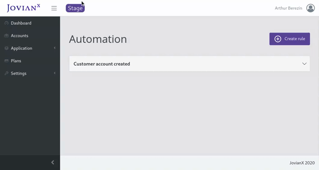

# Automation

Automation allows creating automation rules, that trigger actions based on JovianX events. Once a rule is triggered it calls an action webhook, that can send information from JovianX to external cloud services. **Automation** effectively allows integration with external services such as [HubSpot](https://hubspot.com), [Slack](https://slack.com), [Jira](https://www.atlassian.com/software/jira), [Freshdesk](https://freshdesk.com/), [Pager Duty](https://pagerduty.com/) and others. 

### Events‌

JovianX allows configuring automation rules for the following events:

* Customer account created
* Customer account deleted
* Customer account trial is over
* Customer account user created
* Customer account user logged in
* Application helm parameters changed
* Application launch settings changed
* Application upgraded
* Application error
* Email notification sent

### Actions

JovianX supports the following action Types:



### Webhook

JovianX calls a webhook when an automation rule is triggered. ‌To configure a Webhook set the following settings:

#### URL 

The URL of the Webhook Must be a valid web address URI.

#### ‌Method

You can define the URL method for JovianX to trigger, following methods are supported:

* GET
* POST
* PUT
* PATCH

#### **Headers**

Custom headers are supported, you can  define a custom `key: value` pairs of headers. Additionally, you can use **variables** as header `values`:

**Content:** 

The content section holds the Webhook request content data, you can define the content type and configure the data to send. 

**Content Type**

* JSON
* MULTIPART/FORM-DATA
* X-WWW-FORM-URLENCODED

**JSON** content-type allows defining the JSON content data:

**MULTIPART/FORM-DATA** and **X-WWW-FORM-URLENCODED** allow setting the `key:value` data:




### Available Variables

Events expose a set of **variables** that can be used as event data or headers when triggering an action:

<table>
  <thead>
    <tr>
      <th style="text-align:left">Event</th>
      <th style="text-align:left">Supported Variables</th>
    </tr>
  </thead>
  <tbody>
    <tr>
      <td style="text-align:left">
        
<b>Customer account created</b>
        

        
Event triggered on successful customer account creation.

      </td>
      <td style="text-align:left">
        
<b>{{account_id}}</b>: Account identifier

        
<b>{{account_display_name}}</b>: Account company name provided during
          registration

      </td>
    </tr>
    <tr>
      <td style="text-align:left">
        
<b>Customer account deleted</b>
        

        
Event triggered on deletion of customer account.

      </td>
      <td style="text-align:left">
        
<b>{{account_id}}</b>: Account identifier

        
<b>{{account_display_name}}</b>: Account company name provided during
          registration

      </td>
    </tr>
    <tr>
      <td style="text-align:left">
        
<b>Customer account trial is over</b>
        

        
Event triggered when customer account trial period is over.

      </td>
      <td style="text-align:left">
        
<b>{{account_id}}</b>: Account identifier

        
<b>{{account_display_name}}</b>: Account company name provided during
          registration

      </td>
    </tr>
    <tr>
      <td style="text-align:left">
        
<b>Customer account user created</b>
        

        
Event triggered on creation of new account user

      </td>
      <td style="text-align:left">
        
<b>{{account_id}}</b>: Account identifier

        
<b>{{account_display_name}}</b>: Account company name provided during
          registration

        
<b>{{user_email}}</b>: User email address

        
<b>{{user_name}}</b>: User full name

      </td>
    </tr>
    <tr>
      <td style="text-align:left">
        
<b>Customer account user logged in</b>
        

        
Event triggered when account user logs into the customer console.

      </td>
      <td style="text-align:left">
        
<b>{{account_id}}</b>: Account identifier

        
<b>{{account_display_name}}</b>: Account company name provided during
          registration

        
<b>{{user_email}}</b>: User email address

        
<b>{{user_name}}</b>: User full name

      </td>
    </tr>
    <tr>
      <td style="text-align:left">
        
<b>Application helm parameters changed</b>
        

        
Event triggered on update of application &apos; &apos;components helm
          parameters.

      </td>
      <td style="text-align:left">
        
<b>{{account_id}}</b>: Account identifier

        
<b>{{account_display_name}}</b>: Account company name provided during
          registration

        
<b>{{parameters}}</b>: Application components helm parameters after successful
          update

      </td>
    </tr>
    <tr>
      <td style="text-align:left">
        
<b>Application launch settings changed</b>
        

        
Event triggered when account settings are changed.

      </td>
      <td style="text-align:left">
        
<b>{{account_id}}</b>: Account identifier

        
<b>{{account_display_name}}</b>: Account company name provided during
          registration

        
<b>{{parameters}}</b>: Application components helm parameters after successful
          update

        
<b>{{application_settings}}</b>: New application settings chosen by user.

      </td>
    </tr>
    <tr>
      <td style="text-align:left">
        
<b>Application upgraded</b>
        

        
Event triggered after successful application blueprint &apos; &apos;version
          change.

      </td>
      <td style="text-align:left">
        
<b>{{account_id}}</b>: Account identifier

        
<b>{{account_display_name}}</b>: Account company name provided during
          registration

        
<b>{{parameters}}</b>: Application components helm parameters after successful
          upgrade.

        
<b>{{old_blueprint_version}}</b>: Application blueprint version before
          upgrade

        
<b>{{new_blueprint_version}}</b>: Application blueprint version after
          upgrade

      </td>
    </tr>
    <tr>
      <td style="text-align:left">
        
<b>Application error</b>
        

        
Event triggered when application state changes to &quot;error&quot;.

      </td>
      <td style="text-align:left">
        
<b>{{account_id}}</b>: Account identifier

        
<b>{{account_display_name}}</b>: Account company name provided during
          registration

        
<b>{{previous_state}}</b>: Application state before it was changed to
          &quot;error&quot;

        
<b>{{parameters}}</b>: Application components helm parameters

        
<b>{{application_settings}}</b>: Application settings chosen by user

      </td>
    </tr>
    <tr>
      <td style="text-align:left">
        
<b>Email notification sent</b>
        

        
Event triggered after an email notification is sent.

      </td>
      <td style="text-align:left">
        
<b>{{account_id}}</b>: Account identifier

        
<b>{{account_display_name}}</b>: Account company name provided during
          registration

        
<b>{{receiver}}</b>: To whom notification was sent

        
<b>{{subject}}</b>: Subject of the email notification

        
<b>{{message}}</b>: Body of the email notification

      </td>
    </tr>
  </tbody>
</table>

### Creating a new automation Rule

To create a new automation rule :

1. Navigate to `Settings` &gt; `Automation` on the side-menu.
2. Click on Create rule button on the upper left side

#### Example JovianX &gt; Slack integration:

